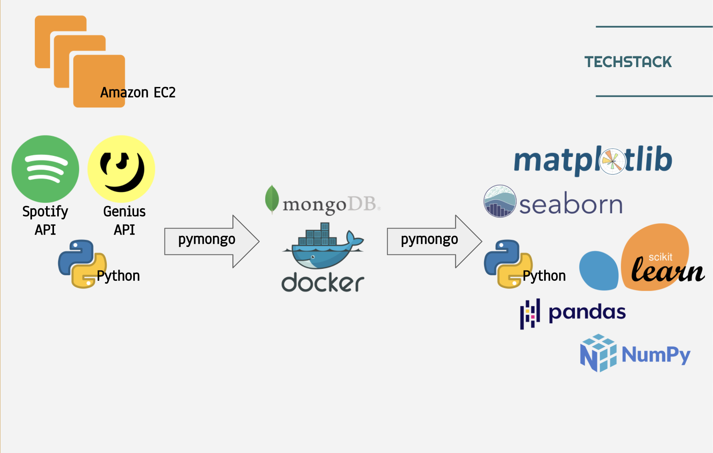

# Vinyl Record Recommender

Are you a lover of music? Are you looking for a new(-ish) medium to enjoy the music you love?

## Data sources
- [__Spotify API__](https://developer.spotify.com/documentation/web-api/) 
- [__Genius__](https://genius.com/developers) 

Album metadata was acquired through the Spotify API and lyrics provided by Genius API.

## Techstack

Python script to pull album metadata (album features and lyrics) into MongoDB using pymongo python wrapper for MongoDB.

## Progress Notes
Sept 30, 2020:
mongo DBs
raw_album_info - album script, sp instant outside loop; err - timeout
raw_album_info_2 - albums script, sp instant in loop; testing

### Next steps
1. Continue to acquire more data. Adjust album scrapper script to load raw API pulls into Mongo
2. Analyze how audio features transition from track to track. Extract audio analysis from Spotify API to look further into the
3. Create user profiles to test album recommender. Metrics for user success: CTR on album recommender. Provide 30 second audio samples for each song once the album is clicked by user, count number of track selected by user.
